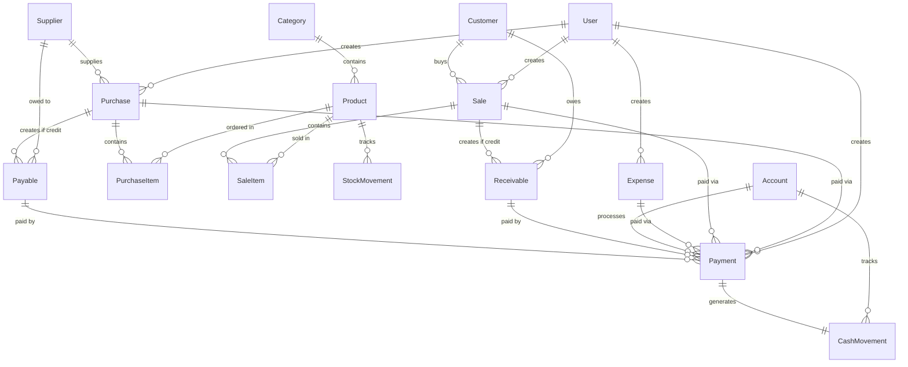
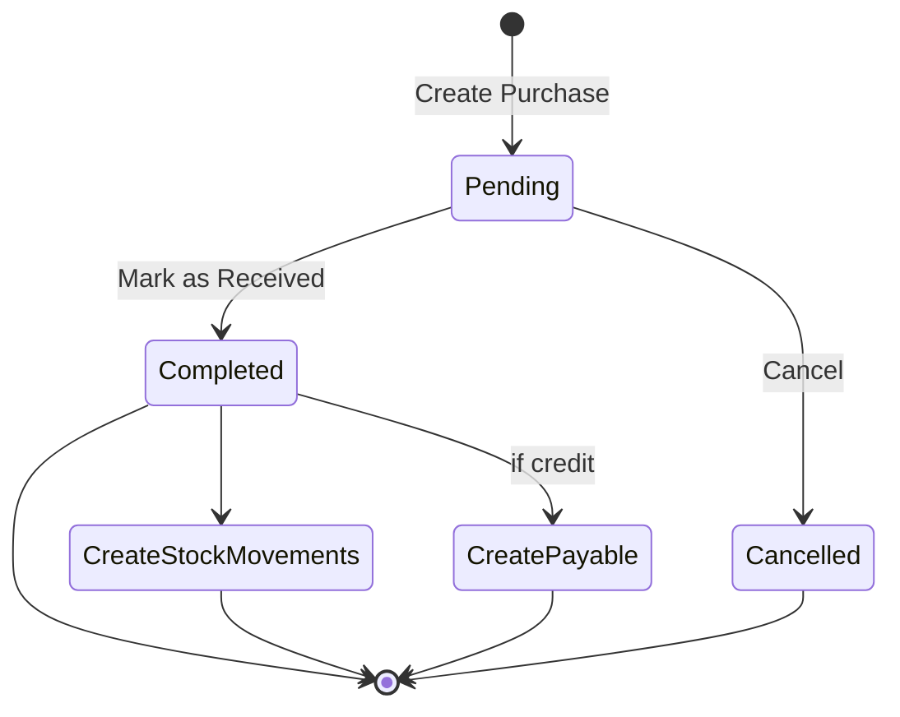
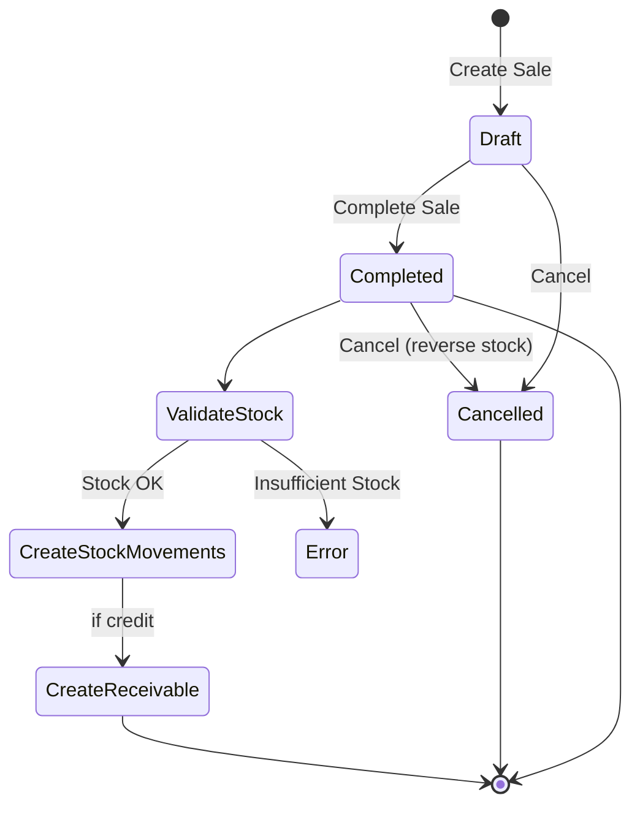
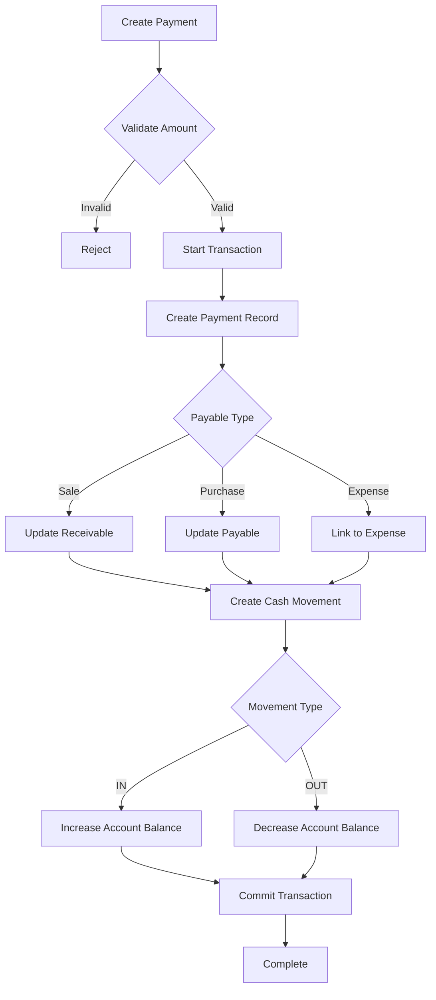

# Technical Design Document

## Overview

This document provides the technical design for a construction shop inventory management system built with Laravel 13, Filament PHP 5.x, and SQLite. The system manages the complete lifecycle of inventory operations including product management, purchasing, sales, stock movements, financial accounts, payments, expenses, and credit tracking (receivables/payables).

The design emphasizes:
- Clean separation between data models and business logic
- Service layer for complex transactional operations
- Filament resources for rapid admin panel development
- Comprehensive audit trails and user tracking
- Role-based access control via Filament Shield

## Architecture

### Technology Stack

- **Framework**: Laravel 13.x
- **Admin Panel**: Filament PHP 5.x
- **Authentication**: Laravel Breeze (integrated with Filament)
- **Authorization**: Spatie Laravel Permission (integrated via Filament Shield 4.2)
- **Database**: SQLite
- **PHP Version**: 8.3+

### Application Layers

```
┌─────────────────────────────────────┐
│     Filament Resources (UI)         │
│  - Forms, Tables, Actions           │
└─────────────────────────────────────┘
              ↓
┌─────────────────────────────────────┐
│      Service Layer                  │
│  - Business Logic                   │
│  - Transaction Management           │
│  - Stock Calculations               │
└─────────────────────────────────────┘
              ↓
┌─────────────────────────────────────┐
│      Eloquent Models                │
│  - Relationships                    │
│  - Accessors/Mutators               │
│  - Scopes                           │
└─────────────────────────────────────┘
              ↓
┌─────────────────────────────────────┐
│      Database (SQLite)              │
└─────────────────────────────────────┘
```

### Directory Structure

```
app/
├── Models/
│   ├── User.php
│   ├── Category.php
│   ├── Product.php
│   ├── Supplier.php
│   ├── Customer.php
│   ├── Purchase.php
│   ├── PurchaseItem.php
│   ├── Sale.php
│   ├── SaleItem.php
│   ├── StockMovement.php
│   ├── Account.php
│   ├── Payment.php
│   ├── CashMovement.php
│   ├── Expense.php
│   ├── Receivable.php
│   └── Payable.php
├── Filament/
│   └── Resources/
│       ├── CategoryResource.php
│       ├── ProductResource.php
│       ├── SupplierResource.php
│       ├── CustomerResource.php
│       ├── PurchaseResource.php
│       ├── SaleResource.php
│       ├── StockMovementResource.php
│       ├── AccountResource.php
│       ├── PaymentResource.php
│       ├── ExpenseResource.php
│       ├── ReceivableResource.php
│       └── PayableResource.php
├── Services/
│   ├── PurchaseService.php
│   ├── SaleService.php
│   ├── StockService.php
│   ├── PaymentService.php
│   └── AccountService.php
└── Enums/
    ├── UnitType.php
    ├── PurchaseStatus.php
    ├── SaleStatus.php
    ├── PaymentType.php
    ├── PaymentMethod.php
    ├── AccountType.php
    ├── StockMovementType.php
    └── CashMovementType.php
```

## Components and Interfaces

### Database Schema

#### Entity Relationship Overview



#### Tables and Columns

**users** (provided by Laravel)
- id: bigint (PK)
- name: string
- email: string (unique)
- password: string
- created_at: timestamp
- updated_at: timestamp

**categories**
- id: bigint (PK)
- name: string
- description: text (nullable)
- created_at: timestamp
- updated_at: timestamp

**products**
- id: bigint (PK)
- category_id: bigint (FK → categories.id)
- name: string
- description: text (nullable)
- unit: enum (kg, piece, m3, bag, liter)
- minimum_stock: decimal(10,2) (default: 0)
- created_at: timestamp
- updated_at: timestamp

**suppliers**
- id: bigint (PK)
- name: string
- contact: string (nullable)
- email: string (nullable)
- address: text (nullable)
- city: string (nullable)
- created_at: timestamp
- updated_at: timestamp

**customers**
- id: bigint (PK)
- name: string
- contact: string (nullable)
- email: string (nullable)
- address: text (nullable)
- city: string (nullable)
- created_at: timestamp
- updated_at: timestamp

**purchases**
- id: bigint (PK)
- supplier_id: bigint (FK → suppliers.id)
- user_id: bigint (FK → users.id)
- purchase_date: date
- expected_date: date (nullable)
- received_date: date (nullable)
- payment_type: enum (cash, credit)
- status: enum (pending, completed, cancelled)
- notes: text (nullable)
- created_at: timestamp
- updated_at: timestamp

**purchase_items**
- id: bigint (PK)
- purchase_id: bigint (FK → purchases.id, cascade delete)
- product_id: bigint (FK → products.id)
- quantity: decimal(10,2)
- unit_price: decimal(10,2)
- total_price: decimal(10,2)
- created_at: timestamp
- updated_at: timestamp

**sales**
- id: bigint (PK)
- customer_id: bigint (FK → customers.id, nullable for walk-in)
- user_id: bigint (FK → users.id)
- sale_date: date
- payment_type: enum (cash, credit)
- status: enum (draft, completed, cancelled)
- notes: text (nullable)
- created_at: timestamp
- updated_at: timestamp

**sale_items**
- id: bigint (PK)
- sale_id: bigint (FK → sales.id, cascade delete)
- product_id: bigint (FK → products.id)
- quantity: decimal(10,2)
- unit_price: decimal(10,2)
- total_price: decimal(10,2)
- created_at: timestamp
- updated_at: timestamp

**stock_movements**
- id: bigint (PK)
- product_id: bigint (FK → products.id)
- transaction_date: date
- type: enum (purchase, sale, adjustment, damage)
- quantity_in: decimal(10,2) (nullable)
- quantity_out: decimal(10,2) (nullable)
- reference_type: string (nullable, polymorphic)
- reference_id: bigint (nullable, polymorphic)
- notes: text (nullable)
- created_at: timestamp
- updated_at: timestamp

**accounts**
- id: bigint (PK)
- name: string
- type: enum (cash, bank, mobile_money)
- balance: decimal(12,2) (default: 0)
- created_at: timestamp
- updated_at: timestamp

**payments**
- id: bigint (PK)
- account_id: bigint (FK → accounts.id)
- user_id: bigint (FK → users.id)
- payable_type: string (polymorphic: Sale, Purchase, Expense)
- payable_id: bigint (polymorphic)
- amount: decimal(10,2)
- payment_method: enum (cash, bank_transfer, mobile_money, check)
- payment_date: date
- notes: text (nullable)
- created_at: timestamp
- updated_at: timestamp

**cash_movements**
- id: bigint (PK)
- account_id: bigint (FK → accounts.id)
- payment_id: bigint (FK → payments.id)
- transaction_date: date
- type: enum (in, out)
- amount: decimal(10,2)
- created_at: timestamp
- updated_at: timestamp

**expenses**
- id: bigint (PK)
- user_id: bigint (FK → users.id)
- category: string
- amount: decimal(10,2)
- expense_date: date
- description: text (nullable)
- created_at: timestamp
- updated_at: timestamp

**receivables**
- id: bigint (PK)
- sale_id: bigint (FK → sales.id)
- customer_id: bigint (FK → customers.id)
- amount: decimal(10,2)
- remaining_balance: decimal(10,2)
- due_date: date
- created_at: timestamp
- updated_at: timestamp

**payables**
- id: bigint (PK)
- purchase_id: bigint (FK → purchases.id)
- supplier_id: bigint (FK → suppliers.id)
- amount: decimal(10,2)
- remaining_balance: decimal(10,2)
- due_date: date
- created_at: timestamp
- updated_at: timestamp

### Indexes

Key indexes for performance:
- products: index on category_id
- purchase_items: index on purchase_id, product_id
- sale_items: index on sale_id, product_id
- stock_movements: index on product_id, transaction_date, reference_type/reference_id
- payments: index on payable_type/payable_id, account_id
- receivables: index on customer_id, sale_id
- payables: index on supplier_id, purchase_id

## Data Models

### Enums

**UnitType** (app/Enums/UnitType.php)
```php
enum UnitType: string
{
    case KG = 'kg';
    case PIECE = 'piece';
    case M3 = 'm3';
    case BAG = 'bag';
    case LITER = 'liter';
}
```

**PurchaseStatus** (app/Enums/PurchaseStatus.php)
```php
enum PurchaseStatus: string
{
    case PENDING = 'pending';
    case COMPLETED = 'completed';
    case CANCELLED = 'cancelled';
}
```

**SaleStatus** (app/Enums/SaleStatus.php)
```php
enum SaleStatus: string
{
    case DRAFT = 'draft';
    case COMPLETED = 'completed';
    case CANCELLED = 'cancelled';
}
```

**PaymentType** (app/Enums/PaymentType.php)
```php
enum PaymentType: string
{
    case CASH = 'cash';
    case CREDIT = 'credit';
}
```

**PaymentMethod** (app/Enums/PaymentMethod.php)
```php
enum PaymentMethod: string
{
    case CASH = 'cash';
    case BANK_TRANSFER = 'bank_transfer';
    case MOBILE_MONEY = 'mobile_money';
    case CHECK = 'check';
}
```

**AccountType** (app/Enums/AccountType.php)
```php
enum AccountType: string
{
    case CASH = 'cash';
    case BANK = 'bank';
    case MOBILE_MONEY = 'mobile_money';
}
```

**StockMovementType** (app/Enums/StockMovementType.php)
```php
enum StockMovementType: string
{
    case PURCHASE = 'purchase';
    case SALE = 'sale';
    case ADJUSTMENT = 'adjustment';
    case DAMAGE = 'damage';
}
```

**CashMovementType** (app/Enums/CashMovementType.php)
```php
enum CashMovementType: string
{
    case IN = 'in';
    case OUT = 'out';
}
```

### Model Relationships

**Category Model**
```php
// Relationships
public function products(): HasMany
```

**Product Model**
```php
// Relationships
public function category(): BelongsTo
public function purchaseItems(): HasMany
public function saleItems(): HasMany
public function stockMovements(): HasMany

// Computed Properties
public function getCurrentStockAttribute(): float
public function getIsLowStockAttribute(): bool
```

**Supplier Model**
```php
// Relationships
public function purchases(): HasMany
public function payables(): HasMany
```

**Customer Model**
```php
// Relationships
public function sales(): HasMany
public function receivables(): HasMany
```

**Purchase Model**
```php
// Relationships
public function supplier(): BelongsTo
public function user(): BelongsTo
public function items(): HasMany (PurchaseItem)
public function payable(): HasOne
public function payments(): MorphMany

// Computed Properties
public function getTotalAmountAttribute(): float
public function getPaidAmountAttribute(): float
public function getRemainingBalanceAttribute(): float
```

**PurchaseItem Model**
```php
// Relationships
public function purchase(): BelongsTo
public function product(): BelongsTo

// Observers
// - Calculate total_price on save
```

**Sale Model**
```php
// Relationships
public function customer(): BelongsTo (nullable)
public function user(): BelongsTo
public function items(): HasMany (SaleItem)
public function receivable(): HasOne
public function payments(): MorphMany

// Computed Properties
public function getTotalAmountAttribute(): float
public function getPaidAmountAttribute(): float
public function getRemainingBalanceAttribute(): float
public function getIsWalkInAttribute(): bool
```

**SaleItem Model**
```php
// Relationships
public function sale(): BelongsTo
public function product(): BelongsTo

// Observers
// - Calculate total_price on save
```

**StockMovement Model**
```php
// Relationships
public function product(): BelongsTo
public function reference(): MorphTo

// Scopes
public function scopeForProduct($query, $productId)
public function scopeByType($query, $type)
```

**Account Model**
```php
// Relationships
public function payments(): HasMany
public function cashMovements(): HasMany
```

**Payment Model**
```php
// Relationships
public function account(): BelongsTo
public function user(): BelongsTo
public function payable(): MorphTo
public function cashMovement(): HasOne
```

**CashMovement Model**
```php
// Relationships
public function account(): BelongsTo
public function payment(): BelongsTo
```

**Expense Model**
```php
// Relationships
public function user(): BelongsTo
public function payments(): MorphMany
```

**Receivable Model**
```php
// Relationships
public function sale(): BelongsTo
public function customer(): BelongsTo
public function payments(): MorphMany

// Computed Properties
public function getIsFullyPaidAttribute(): bool
```

**Payable Model**
```php
// Relationships
public function purchase(): BelongsTo
public function supplier(): BelongsTo
public function payments(): MorphMany

// Computed Properties
public function getIsFullyPaidAttribute(): bool
```

## Service Layer Architecture

The service layer encapsulates complex business logic and ensures data consistency through database transactions.

### PurchaseService

**Responsibilities:**
- Create purchases with items
- Update purchase status
- Handle purchase completion (create stock movements, payables)
- Handle purchase cancellation

**Key Methods:**
```php
public function createPurchase(array $data, array $items): Purchase
public function updatePurchaseStatus(Purchase $purchase, PurchaseStatus $status, ?string $receivedDate = null): void
public function completePurchase(Purchase $purchase, string $receivedDate): void
public function cancelPurchase(Purchase $purchase): void
```

**Business Rules:**
- When status changes to "completed": create stock movements, create payable if credit
- When status changes to "cancelled": prevent stock movement creation
- Calculate total amounts from items
- Validate received_date when completing

### SaleService

**Responsibilities:**
- Create sales with items
- Update sale status
- Handle sale completion (create stock movements, receivables)
- Handle sale cancellation (reverse stock movements)

**Key Methods:**
```php
public function createSale(array $data, array $items): Sale
public function updateSaleStatus(Sale $sale, SaleStatus $status): void
public function completeSale(Sale $sale): void
public function cancelSale(Sale $sale): void
```

**Business Rules:**
- When status changes to "completed": create stock movements, create receivable if credit
- When status changes to "cancelled": reverse stock movements
- Validate sufficient stock before completing sale
- Calculate total amounts from items

### StockService

**Responsibilities:**
- Create stock movements
- Calculate current stock levels
- Validate stock availability
- Handle stock adjustments and damage records

**Key Methods:**
```php
public function createMovement(Product $product, StockMovementType $type, float $quantity, ?Model $reference = null, ?string $notes = null): StockMovement
public function getCurrentStock(Product $product): float
public function validateStockAvailability(Product $product, float $quantity): bool
public function adjustStock(Product $product, float $quantity, string $notes): StockMovement
public function recordDamage(Product $product, float $quantity, string $notes): StockMovement
public function getLowStockProducts(): Collection
```

**Business Rules:**
- Prevent negative stock (configurable)
- Track all movements with references
- Calculate stock as: SUM(quantity_in) - SUM(quantity_out)

### PaymentService

**Responsibilities:**
- Process payments for sales, purchases, expenses
- Update receivables/payables
- Create cash movements
- Update account balances

**Key Methods:**
```php
public function processPayment(Model $payable, Account $account, float $amount, PaymentMethod $method, string $date, ?string $notes = null): Payment
public function validatePaymentAmount(Model $payable, float $amount): bool
```

**Business Rules:**
- Payment amount cannot exceed remaining balance
- Create cash movement (in/out based on payable type)
- Update account balance
- Update receivable/payable remaining balance
- All operations in database transaction

### AccountService

**Responsibilities:**
- Update account balances
- Validate balance operations
- Calculate account totals

**Key Methods:**
```php
public function updateBalance(Account $account, float $amount, CashMovementType $type): void
public function validateBalance(Account $account, float $amount): bool
```

**Business Rules:**
- Prevent negative balances (configurable)
- Track all balance changes via cash movements

## Filament Resources

### Resource Organization

Each major entity has a Filament Resource with:
- Form schema for create/edit
- Table columns for list view
- Filters for data filtering
- Actions for common operations
- Relation managers for nested data

### Key Resources

**ProductResource**
- Form: name, category, unit, description, minimum_stock
- Table: name, category, unit, current_stock, minimum_stock, low_stock_badge
- Filters: category, low_stock
- Relation Manager: stock_movements

**PurchaseResource**
- Form: supplier, purchase_date, expected_date, payment_type, status, items (repeater)
- Table: id, supplier, purchase_date, total_amount, status, payment_type
- Filters: status, payment_type, date_range
- Actions: complete, cancel, add_payment
- Relation Managers: items, payments

**SaleResource**
- Form: customer (nullable), sale_date, payment_type, status, items (repeater)
- Table: id, customer, sale_date, total_amount, status, payment_type
- Filters: status, payment_type, date_range
- Actions: complete, cancel, add_payment
- Relation Managers: items, payments

**PaymentResource**
- Form: payable_type, payable_id, account, amount, payment_method, payment_date
- Table: id, payable_type, payable_id, amount, payment_method, payment_date, account
- Filters: payment_method, account, date_range

**ReceivableResource**
- Table: customer, sale_id, amount, remaining_balance, due_date, status_badge
- Filters: customer, overdue, fully_paid
- Actions: add_payment

**PayableResource**
- Table: supplier, purchase_id, amount, remaining_balance, due_date, status_badge
- Filters: supplier, overdue, fully_paid
- Actions: add_payment

### Form Patterns

**Repeater for Line Items** (Purchase/Sale Items)
```php
Forms\Components\Repeater::make('items')
    ->relationship()
    ->schema([
        Forms\Components\Select::make('product_id')
            ->relationship('product', 'name')
            ->required()
            ->reactive(),
        Forms\Components\TextInput::make('quantity')
            ->numeric()
            ->required()
            ->reactive(),
        Forms\Components\TextInput::make('unit_price')
            ->numeric()
            ->required()
            ->reactive(),
        Forms\Components\TextInput::make('total_price')
            ->numeric()
            ->disabled()
            ->dehydrated(),
    ])
    ->columns(4)
```

**Status Badges**
```php
Tables\Columns\BadgeColumn::make('status')
    ->colors([
        'warning' => 'pending',
        'success' => 'completed',
        'danger' => 'cancelled',
    ])
```

## Key Workflows

### Purchase Workflow



**Steps:**
1. User creates purchase with supplier, items, payment_type
2. System calculates total from items
3. System saves purchase with status "pending"
4. When received:
   - User marks as "completed" with received_date
   - System creates stock_movements (type: purchase, quantity_in)
   - If payment_type is "credit": create payable record
5. User can add payments via PaymentService

### Sale Workflow



**Steps:**
1. User creates sale with customer (optional), items, payment_type
2. System calculates total from items
3. System saves sale with status "draft"
4. When completing:
   - System validates stock availability for all items
   - System creates stock_movements (type: sale, quantity_out)
   - If payment_type is "credit": create receivable record
   - System updates status to "completed"
5. User can add payments via PaymentService

### Payment Workflow



**Steps:**
1. User initiates payment for sale/purchase/expense
2. System validates amount ≤ remaining balance
3. System creates payment record
4. System updates receivable/payable remaining_balance
5. System creates cash_movement (in for sales, out for purchases/expenses)
6. System updates account balance
7. All in database transaction

### Stock Movement Tracking

**Automatic Creation:**
- Purchase completed → stock_movement (type: purchase, quantity_in, reference: purchase)
- Sale completed → stock_movement (type: sale, quantity_out, reference: sale)

**Manual Creation:**
- Stock adjustment → stock_movement (type: adjustment, quantity_in or quantity_out)
- Damage record → stock_movement (type: damage, quantity_out)

**Current Stock Calculation:**
```php
$currentStock = StockMovement::where('product_id', $productId)
    ->sum('quantity_in') - StockMovement::where('product_id', $productId)
    ->sum('quantity_out');
```

## Error Handling

### Validation Rules

**Quantity Validation:**
- Must be > 0 for all transactions
- Must not result in negative stock (configurable)

**Price Validation:**
- Must be ≥ 0

**Payment Validation:**
- Amount must be > 0
- Amount must not exceed remaining balance
- Account must have sufficient balance (for outgoing payments, if enforced)

**Date Validation:**
- Must be valid date format
- received_date must be ≥ purchase_date
- due_date should be > transaction_date

### Exception Handling

**Service Layer Exceptions:**
- `InsufficientStockException`: Thrown when sale cannot be completed due to low stock
- `InvalidPaymentAmountException`: Thrown when payment exceeds balance
- `InvalidStatusTransitionException`: Thrown when status change is not allowed

**Transaction Rollback:**
All service methods use database transactions:
```php
DB::transaction(function () {
    // Business logic
});
```

On exception, all changes are rolled back automatically.

## Testing Strategy

### Testing Approach Overview

This construction inventory system is primarily a database-driven CRUD application with complex business workflows. The testing strategy emphasizes:

1. **Unit Tests**: For calculation logic and model methods
2. **Integration Tests**: For service layer workflows and database transactions
3. **Feature Tests**: For Filament resources and end-to-end workflows
4. **Limited Property-Based Testing**: For pure calculation functions only

**Why Limited PBT?**

Property-based testing is most valuable for pure functions with universal properties. This system's core value lies in:
- Database transaction integrity
- Workflow state management
- UI interactions via Filament
- Business rule enforcement through service layer

These are better tested through integration and feature tests. However, PBT is appropriate for specific calculation functions.

### Property-Based Testing (Limited Scope)

**Applicable Areas:**

The following pure calculation functions benefit from property-based testing:

**Property 1: Line Item Total Calculation**

*For any* purchase item or sale item with quantity > 0 and unit_price ≥ 0, the total_price SHALL equal quantity multiplied by unit_price.

**Validates: Requirements 4.7, 5.7**

**Property 2: Stock Balance Calculation**

*For any* product with a sequence of stock movements, the current stock SHALL equal the sum of all quantity_in minus the sum of all quantity_out.

**Validates: Requirements 6.4, 14.2**

**Property 3: Payment Balance Reduction**

*For any* receivable or payable with initial amount A and a series of payments totaling P (where P ≤ A), the remaining_balance SHALL equal A - P.

**Validates: Requirements 11.3, 11.6, 12.3, 12.6**

**Property 4: Account Balance Updates**

*For any* account with initial balance B and a series of cash movements (in: I, out: O), the final balance SHALL equal B + I - O.

**Validates: Requirements 9.5**

**Property 5: Transaction Total Calculation**

*For any* purchase or sale with N items, the total_amount SHALL equal the sum of all item total_prices.

**Validates: Requirements 4.7, 5.7**

**PBT Implementation Notes:**
- Use **Pest PHP** with **pest-plugin-faker** for property-based testing
- Minimum 100 iterations per property test
- Tag each test: `Feature: construction-inventory-system, Property {number}: {description}`
- Focus on calculation logic, not database operations
- Use in-memory calculations without database for pure function tests

### Unit Testing

**Model Tests:**
- Relationship integrity (belongsTo, hasMany, morphTo)
- Computed properties (current_stock, is_low_stock, total_amount, remaining_balance)
- Enum casting and validation
- Accessor/mutator logic

**Service Tests:**
- PurchaseService: create, complete, cancel operations
- SaleService: create, complete, cancel, stock validation
- StockService: movement creation, stock calculation, low stock detection
- PaymentService: payment processing, balance updates, validation
- AccountService: balance operations, validation

**Validation Tests:**
- Quantity > 0 for all transactions
- Price ≥ 0 for all items
- Payment amount ≤ remaining balance
- Stock availability before sale completion
- Date validation (received_date ≥ purchase_date)

**Example Unit Test Structure:**
```php
test('purchase item calculates total price correctly', function () {
    $item = new PurchaseItem([
        'quantity' => 10,
        'unit_price' => 25.50,
    ]);
    
    expect($item->total_price)->toBe(255.00);
});
```

### Integration Testing

**Workflow Tests:**

These tests verify complete business workflows with database transactions:

**Purchase Workflow:**
- Create purchase with items → verify purchase saved
- Complete purchase → verify stock movements created
- Complete credit purchase → verify payable created
- Cancel purchase → verify no stock movements

**Sale Workflow:**
- Create sale with items → verify sale saved
- Complete sale → verify stock movements created (quantity_out)
- Complete credit sale → verify receivable created
- Cancel completed sale → verify stock movements reversed
- Attempt sale with insufficient stock → verify rejection

**Payment Workflow:**
- Process payment for credit sale → verify receivable updated
- Process payment for credit purchase → verify payable updated
- Process payment for expense → verify expense linked
- Create payment → verify cash movement created
- Create payment → verify account balance updated
- Attempt overpayment → verify rejection

**Stock Management:**
- Multiple purchases → verify cumulative stock increase
- Purchase then sale → verify stock decrease
- Manual adjustment → verify stock movement created
- Record damage → verify stock decrease

**Credit Management:**
- Credit sale → partial payment → verify remaining balance
- Credit sale → full payment → verify fully paid status
- Multiple payments → verify cumulative balance reduction

**Example Integration Test:**
```php
test('completing purchase creates stock movements and updates inventory', function () {
    $product = Product::factory()->create();
    $purchase = Purchase::factory()->create(['status' => PurchaseStatus::PENDING]);
    $purchase->items()->create([
        'product_id' => $product->id,
        'quantity' => 50,
        'unit_price' => 10,
        'total_price' => 500,
    ]);
    
    app(PurchaseService::class)->completePurchase($purchase, now()->toDateString());
    
    expect($purchase->fresh()->status)->toBe(PurchaseStatus::COMPLETED)
        ->and(StockMovement::where('product_id', $product->id)->count())->toBe(1)
        ->and(app(StockService::class)->getCurrentStock($product))->toBe(50.0);
});
```

### Feature Testing (Filament)

**Resource Tests:**

Test Filament resources and user interactions:

**CRUD Operations:**
- Can create product via form
- Can edit product
- Can delete product (where allowed)
- Can view product list
- Can view product details

**Form Validation:**
- Required fields are enforced
- Numeric fields validate correctly
- Enum fields show correct options
- Relationship selects load data

**Table Features:**
- Filters work correctly (status, date range, category)
- Search functionality works
- Sorting works on columns
- Pagination works

**Actions:**
- Complete purchase action works
- Cancel sale action works
- Add payment action works
- Custom actions execute properly

**Relation Managers:**
- Purchase items relation manager displays items
- Can add/edit/delete items through relation manager
- Payments relation manager shows payment history

**Example Feature Test:**
```php
test('can create purchase with items through filament', function () {
    $user = User::factory()->create();
    $supplier = Supplier::factory()->create();
    $product = Product::factory()->create();
    
    actingAs($user);
    
    livewire(CreatePurchase::class)
        ->fillForm([
            'supplier_id' => $supplier->id,
            'purchase_date' => now()->toDateString(),
            'payment_type' => PaymentType::CASH,
            'status' => PurchaseStatus::PENDING,
            'items' => [
                [
                    'product_id' => $product->id,
                    'quantity' => 10,
                    'unit_price' => 50,
                ],
            ],
        ])
        ->call('create')
        ->assertHasNoFormErrors();
    
    expect(Purchase::count())->toBe(1)
        ->and(PurchaseItem::count())->toBe(1);
});
```

**Permission Tests:**
- Users with correct roles can access resources
- Users without permissions are denied (403)
- Shield policies are enforced
- Custom permissions work (complete_purchase, process_payment)

**Example Permission Test:**
```php
test('user without permission cannot access purchases', function () {
    $user = User::factory()->create(); // No roles assigned
    
    actingAs($user);
    
    get(PurchaseResource::getUrl('index'))
        ->assertForbidden();
});
```

### Database Testing

**Constraint Tests:**
- Foreign key constraints prevent orphaned records
- Cascade deletes work correctly (purchase → purchase_items)
- Unique constraints are enforced
- Not null constraints are enforced

**Transaction Tests:**
- Failed operations rollback completely
- Partial failures don't leave inconsistent data
- Concurrent operations handle correctly

**Data Integrity Tests:**
- Stock cannot go negative (if enforced)
- Account balance cannot go negative (if enforced)
- Payment amount cannot exceed remaining balance
- Receivable/payable balances stay consistent

### Test Coverage Goals

**Minimum Coverage Targets:**
- Models: 90% (relationships, computed properties)
- Services: 95% (critical business logic)
- Enums: 100% (simple, easy to cover)
- Overall: 80%

**Critical Paths (100% Coverage Required):**
- Payment processing
- Stock movement creation
- Balance calculations
- Status transitions

### Testing Tools

**Framework:** Pest PHP (Laravel's recommended testing framework)
**Database:** SQLite in-memory for fast tests
**Factories:** Laravel factories for all models
**Mocking:** Mockery for external dependencies (if any)
**Property Testing:** pest-plugin-faker or custom generators

### Continuous Integration

**Test Execution:**
- Run on every commit
- Run full suite before merge
- Separate fast unit tests from slower integration tests

**Test Organization:**
```
tests/
├── Unit/
│   ├── Models/
│   ├── Services/
│   └── Enums/
├── Feature/
│   ├── Filament/
│   └── Workflows/
├── Integration/
│   ├── PurchaseWorkflowTest.php
│   ├── SaleWorkflowTest.php
│   ├── PaymentWorkflowTest.php
│   └── StockManagementTest.php
└── Property/
    ├── CalculationPropertiesTest.php
    └── BalancePropertiesTest.php
```

## Performance Considerations

### Database Optimization

**Eager Loading:**
```php
// In Filament Resources
public static function getEloquentQuery(): Builder
{
    return parent::getEloquentQuery()
        ->with(['category', 'supplier', 'customer', 'user']);
}
```

**Indexes:**
- Foreign keys are indexed
- Frequently queried columns (status, dates) are indexed
- Polymorphic relationships (reference_type, reference_id) are indexed

**Query Optimization:**
- Use `select()` to limit columns
- Use `chunk()` for large datasets
- Cache frequently accessed data (categories, units)

### Caching Strategy

**Cache Keys:**
- Product stock levels: `product.{id}.stock`
- Low stock products: `products.low_stock`
- Account balances: `account.{id}.balance`

**Cache Invalidation:**
- Clear product stock cache on stock_movement creation
- Clear account balance cache on payment creation
- Use cache tags for related data

## Security Considerations

### Authorization

**Filament Shield Integration:**
- All resources protected by policies
- Permissions: view, view_any, create, update, delete
- Custom permissions: complete_purchase, cancel_sale, process_payment

**User Tracking:**
- All transactions linked to creating user
- Audit trail via created_at/updated_at timestamps

### Data Protection

**Soft Deletes:**
- Consider soft deletes for critical entities (purchases, sales, payments)
- Prevents accidental data loss

**Input Sanitization:**
- Filament handles XSS protection
- Validate all numeric inputs
- Sanitize text inputs

### Financial Data Integrity

**Transaction Isolation:**
- Use database transactions for all financial operations
- Prevent race conditions on account balances

**Audit Logging:**
- Log all payment operations
- Log status changes
- Track user actions

## Deployment Considerations

### Database Migrations

**Migration Order:**
1. Create enum types (via migration or use string columns with validation)
2. Create base tables (users, categories, suppliers, customers, accounts)
3. Create transaction tables (purchases, sales, expenses)
4. Create line item tables (purchase_items, sale_items)
5. Create tracking tables (stock_movements, payments, cash_movements)
6. Create credit tables (receivables, payables)
7. Add indexes
8. Seed initial data (roles, permissions, default accounts)

### Seeding Strategy

**Required Seeds:**
- Roles and permissions (via Filament Shield)
- Default categories
- Default account (Cash)
- Admin user

**Optional Seeds:**
- Sample products
- Sample suppliers/customers
- Test transactions (development only)

### Environment Configuration

**Key Settings:**
- Database path (SQLite)
- Filament panel configuration
- Permission cache settings
- Queue driver (for async operations)

## Future Enhancements

### Phase 2 Features

- **Reporting Dashboard**: Sales reports, purchase reports, inventory valuation
- **Barcode Support**: Product barcode scanning
- **Multi-location**: Support for multiple warehouses
- **Purchase Orders**: Separate PO workflow before purchase
- **Invoicing**: Generate PDF invoices for sales
- **Email Notifications**: Low stock alerts, payment reminders

### Phase 3 Features

- **Mobile App**: React Native or Flutter app for field operations
- **API**: RESTful API for third-party integrations
- **Advanced Analytics**: Predictive stock levels, sales forecasting
- **Multi-currency**: Support for foreign suppliers
- **Batch/Serial Tracking**: Track individual items or batches

