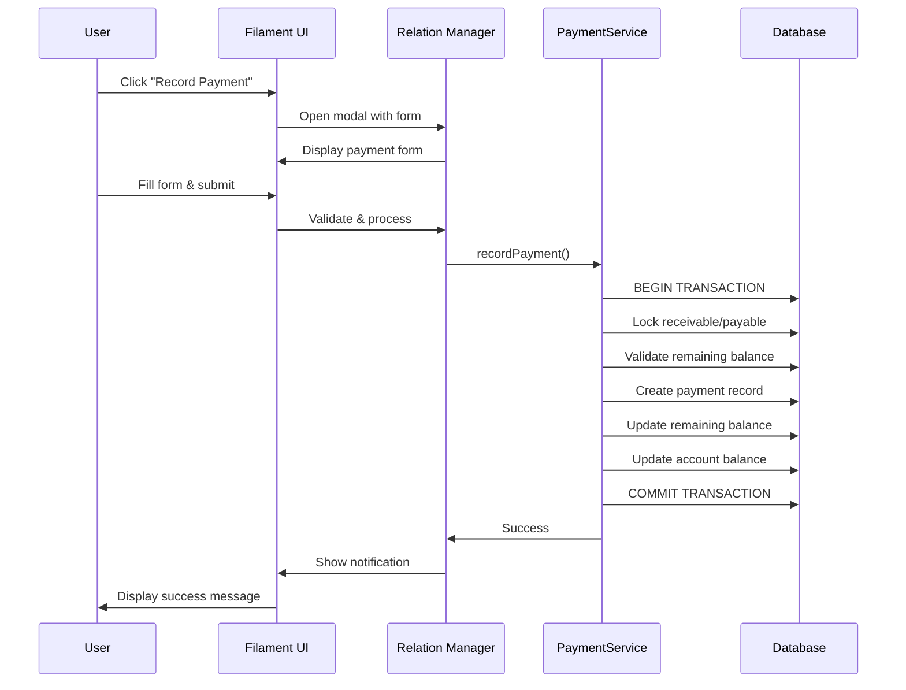

# Design Document: Customer/Supplier Payment Management

## Overview

This feature adds payment management capabilities to Customer and Supplier detail pages in the Filament admin panel. Users can view sales/purchases, receivables/payables, and record payments directly from the customer/supplier context using Filament Relation Managers and modal forms.

### Key Capabilities

- **Customer Context**: View sales and receivables, record payments against receivables
- **Supplier Context**: View purchases and payables, record payments against payables
- **Payment Recording**: Modal forms with validation, account selection, and balance updates
- **Status Tracking**: Visual indicators for paid, pending, and overdue items
- **Audit Trail**: Track who recorded payments and when

### Technology Stack

- **Filament v5**: Relation Managers, Table Actions, Modal Forms
- **Laravel v13**: Eloquent relationships, database transactions
- **Livewire v4**: Reactive UI components
- **PHP 8.4**: Type safety and modern syntax

## Architecture

### Component Hierarchy

```
CustomerResource / SupplierResource
├── ViewCustomer / ViewSupplier (Page)
│   ├── SalesRelationManager
│   │   └── Table with sales data
│   ├── ReceivablesRelationManager
│   │   ├── Table with receivables data
│   │   ├── RecordPaymentAction (Table Action)
│   │   │   └── PaymentForm (Modal)
│   │   └── ViewPaymentsAction (Table Action)
│   │       └── Payments list
│   ├── PurchasesRelationManager
│   │   └── Table with purchases data
│   └── PayablesRelationManager
│       ├── Table with payables data
│       ├── RecordPaymentAction (Table Action)
│       │   └── PaymentForm (Modal)
│       └── ViewPaymentsAction (Table Action)
│           └── Payments list
```

### Data Flow



## Components and Interfaces

### 1. Relation Managers

#### SalesRelationManager
**Location**: `app/Filament/Resources/Customers/RelationManagers/SalesRelationManager.php`

**Purpose**: Display all sales for a customer

**Table Columns**:
- `sale_date` - Date of sale (sortable)
- `total_amount` - Computed from sale items (sortable)
- `payment_type` - Cash or Credit (badge)
- `status` - Sale status (badge with color)
- `notes` - Truncated with tooltip

**Features**:
- Default sort: `sale_date DESC`
- Search: sale attributes
- Link to sale detail page

#### ReceivablesRelationManager
**Location**: `app/Filament/Resources/Customers/RelationManagers/ReceivablesRelationManager.php`

**Purpose**: Display and manage receivables for a customer

**Table Columns**:
- `sale_id` - Link to associated sale
- `amount` - Original receivable amount (sortable)
- `remaining_balance` - Current unpaid amount (sortable, highlighted)
- `due_date` - Payment due date (sortable)
- `status` - Paid/Pending/Overdue (badge with color)

**Table Actions**:
- `RecordPaymentAction` - Opens payment modal (visible when `remaining_balance > 0`)
- `ViewPaymentsAction` - Shows payment history

**Filters**:
- Status filter (Paid, Pending, Overdue)

**Status Logic**:
- **Paid**: `remaining_balance <= 0` (green badge)
- **Pending**: `remaining_balance > 0 AND due_date >= today` (yellow badge)
- **Overdue**: `remaining_balance > 0 AND due_date < today` (red badge)

#### PurchasesRelationManager
**Location**: `app/Filament/Resources/Suppliers/RelationManagers/PurchasesRelationManager.php`

**Purpose**: Display all purchases from a supplier

**Table Columns**:
- `purchase_date` - Date of purchase (sortable)
- `total_amount` - Computed from purchase items (sortable)
- `payment_type` - Cash or Credit (badge)
- `status` - Purchase status (badge with color)
- `notes` - Truncated with tooltip

**Features**:
- Default sort: `purchase_date DESC`
- Search: purchase attributes
- Link to purchase detail page

#### PayablesRelationManager
**Location**: `app/Filament/Resources/Suppliers/RelationManagers/PayablesRelationManager.php`

**Purpose**: Display and manage payables for a supplier

**Table Columns**:
- `purchase_id` - Link to associated purchase
- `amount` - Original payable amount (sortable)
- `remaining_balance` - Current unpaid amount (sortable, highlighted)
- `due_date` - Payment due date (sortable)
- `status` - Paid/Pending/Overdue (badge with color)

**Table Actions**:
- `RecordPaymentAction` - Opens payment modal (visible when `remaining_balance > 0`)
- `ViewPaymentsAction` - Shows payment history

**Filters**:
- Status filter (Paid, Pending, Overdue)

**Status Logic**: Same as ReceivablesRelationManager

### 2. Payment Form Component

#### PaymentFormSchema
**Location**: `app/Filament/Resources/Shared/Schemas/PaymentFormSchema.php`

**Purpose**: Reusable payment form schema for both receivables and payables

**Form Fields**:

```php
Select::make('account_id')
    ->label('Account')
    ->relationship('account', 'name')
    ->getOptionLabelFromRecordUsing(fn (Account $record) => 
        "{$record->name} (Balance: " . number_format($record->balance, 2) . " ETB)"
    )
    ->searchable()
    ->required()
    ->helperText('Select the account to record this payment')

TextInput::make('amount')
    ->label('Payment Amount')
    ->numeric()
    ->required()
    ->minValue(0.01)
    ->maxValue(fn (Get $get) => $get('max_amount'))
    ->suffix('ETB')
    ->helperText(fn (Get $get) => 
        'Maximum: ' . number_format($get('max_amount'), 2) . ' ETB'
    )
    ->live(onBlur: true)

Select::make('payment_method')
    ->label('Payment Method')
    ->options(PaymentMethod::class)
    ->required()
    ->default(PaymentMethod::CASH)

DatePicker::make('payment_date')
    ->label('Payment Date')
    ->required()
    ->default(now())
    ->maxDate(now())

Textarea::make('notes')
    ->label('Notes')
    ->rows(3)
    ->maxLength(500)
```

**Hidden Fields**:
- `max_amount` - Set to `remaining_balance` of the receivable/payable
- `payable_type` - Receivable or Payable class name
- `payable_id` - ID of the receivable/payable

### 3. Payment Service

#### PaymentService
**Location**: `app/Services/PaymentService.php`

**Purpose**: Encapsulate payment processing logic with transaction safety

**Methods**:

```php
public function recordPayment(
    string $payableType,
    int $payableId,
    int $accountId,
    float $amount,
    PaymentMethod $paymentMethod,
    Carbon $paymentDate,
    ?string $notes = null
): Payment

public function validatePaymentAmount(
    string $payableType,
    int $payableId,
    float $amount
): void

public function getAvailableAccounts(): Collection
```

**Transaction Flow**:
1. Begin database transaction
2. Lock receivable/payable record (`lockForUpdate()`)
3. Validate amount against current `remaining_balance`
4. Create `Payment` record
5. Update `remaining_balance` on receivable/payable
6. Update `Account` balance (add for receivables, subtract for payables)
7. Commit transaction
8. Return created payment

**Error Handling**:
- Throws `PaymentValidationException` if amount exceeds remaining balance
- Throws `ConcurrentModificationException` if balance changed during transaction
- Rolls back transaction on any error

## Data Models

### Existing Models (No Changes Required)

#### Payment Model
```php
// app/Models/Payment.php
protected $fillable = [
    'account_id',
    'user_id',
    'payable_type',  // Polymorphic: Receivable or Payable
    'payable_id',
    'amount',
    'payment_method',
    'payment_date',
    'notes',
];

// Relationships
public function account(): BelongsTo
public function user(): BelongsTo
public function payable(): MorphTo  // Receivable or Payable
```

#### Receivable Model
```php
// app/Models/Receivable.php
protected $fillable = [
    'sale_id',
    'customer_id',
    'amount',
    'remaining_balance',
    'due_date',
];

// Relationships
public function sale(): BelongsTo
public function customer(): BelongsTo
public function payments(): MorphMany

// Computed Attributes
public function getPaidAmountAttribute(): float
public function getIsFullyPaidAttribute(): bool
public function getIsOverdueAttribute(): bool
```

#### Payable Model
```php
// app/Models/Payable.php
protected $fillable = [
    'purchase_id',
    'supplier_id',
    'amount',
    'remaining_balance',
    'due_date',
];

// Relationships
public function purchase(): BelongsTo
public function supplier(): BelongsTo
public function payments(): MorphMany

// Computed Attributes
public function getPaidAmountAttribute(): float
public function getIsFullyPaidAttribute(): bool
public function getIsOverdueAttribute(): bool
```

#### Account Model
```php
// app/Models/Account.php
protected $fillable = [
    'name',
    'type',
    'balance',
    'description',
];

// Relationships
public function payments(): HasMany
```

### Database Schema Interactions

#### Payment Creation Flow

```sql
-- 1. Lock the receivable/payable
SELECT * FROM receivables WHERE id = ? FOR UPDATE;

-- 2. Validate remaining balance
-- (Done in application code)

-- 3. Insert payment record
INSERT INTO payments (
    account_id, user_id, payable_type, payable_id,
    amount, payment_method, payment_date, notes,
    created_at, updated_at
) VALUES (?, ?, ?, ?, ?, ?, ?, ?, NOW(), NOW());

-- 4. Update receivable/payable remaining balance
UPDATE receivables 
SET remaining_balance = remaining_balance - ?
WHERE id = ?;

-- 5. Update account balance
-- For receivables (money coming in):
UPDATE accounts SET balance = balance + ? WHERE id = ?;

-- For payables (money going out):
UPDATE accounts SET balance = balance - ? WHERE id = ?;
```

## Error Handling

### Validation Errors

#### Client-Side Validation (Filament Form)
- **Empty amount**: "Payment amount is required"
- **Zero/negative amount**: "Payment amount must be greater than zero"
- **Amount exceeds balance**: "Payment amount cannot exceed remaining balance of X.XX ETB"
- **No account selected**: "Please select an account"
- **Future payment date**: "Payment date cannot be in the future"

#### Server-Side Validation (PaymentService)
```php
class PaymentValidationException extends Exception
{
    public static function amountExceedsBalance(float $amount, float $balance): self
    {
        return new self(
            "Payment amount {$amount} exceeds remaining balance {$balance}"
        );
    }
    
    public static function invalidAmount(float $amount): self
    {
        return new self(
            "Payment amount must be greater than zero, got {$amount}"
        );
    }
    
    public static function noAccountsAvailable(): self
    {
        return new self(
            "No accounts available for payment"
        );
    }
}
```

### Concurrency Errors

```php
class ConcurrentModificationException extends Exception
{
    public static function balanceChanged(float $expected, float $actual): self
    {
        return new self(
            "Remaining balance changed during transaction. " .
            "Expected {$expected}, found {$actual}. " .
            "Please refresh and try again."
        );
    }
}
```

### Error Recovery

**User Experience**:
1. Display error notification with clear message
2. Keep modal open with entered data
3. Allow user to adjust amount and retry
4. Suggest refreshing if concurrent modification detected

**Logging**:
- Log all payment validation failures
- Log all concurrent modification attempts
- Log all successful payments with user ID and timestamp

## Testing Strategy

### Unit Tests

**PaymentServiceTest**:
- `test_records_payment_for_receivable()`
- `test_records_payment_for_payable()`
- `test_validates_amount_exceeds_balance()`
- `test_validates_zero_amount()`
- `test_validates_negative_amount()`
- `test_updates_receivable_remaining_balance()`
- `test_updates_payable_remaining_balance()`
- `test_updates_account_balance_for_receivable()`
- `test_updates_account_balance_for_payable()`
- `test_records_user_who_created_payment()`
- `test_handles_partial_payments()`
- `test_prevents_overpayment()`

**Model Tests**:
- `test_receivable_status_is_paid_when_balance_zero()`
- `test_receivable_status_is_pending_when_not_overdue()`
- `test_receivable_status_is_overdue_when_past_due()`
- `test_payable_status_is_paid_when_balance_zero()`
- `test_payable_status_is_pending_when_not_overdue()`
- `test_payable_status_is_overdue_when_past_due()`

### Feature Tests

**ReceivablesRelationManagerTest**:
- `test_displays_receivables_for_customer()`
- `test_displays_correct_status_badges()`
- `test_filters_by_status()`
- `test_sorts_by_due_date()`
- `test_shows_record_payment_action_for_unpaid()`
- `test_hides_record_payment_action_for_paid()`
- `test_opens_payment_modal_on_action_click()`
- `test_validates_payment_form()`
- `test_records_payment_successfully()`
- `test_displays_success_notification()`
- `test_refreshes_table_after_payment()`

**PayablesRelationManagerTest**:
- `test_displays_payables_for_supplier()`
- `test_displays_correct_status_badges()`
- `test_filters_by_status()`
- `test_sorts_by_due_date()`
- `test_shows_record_payment_action_for_unpaid()`
- `test_hides_record_payment_action_for_paid()`
- `test_opens_payment_modal_on_action_click()`
- `test_validates_payment_form()`
- `test_records_payment_successfully()`
- `test_displays_success_notification()`
- `test_refreshes_table_after_payment()`

### Integration Tests

**PaymentIntegrationTest**:
- `test_concurrent_payment_handling()`
- `test_transaction_rollback_on_error()`
- `test_account_balance_consistency()`
- `test_multiple_partial_payments()`
- `test_payment_audit_trail()`

### Manual Testing Checklist

- [ ] Customer sales display correctly
- [ ] Customer receivables display with correct status
- [ ] Record payment modal opens and validates
- [ ] Payment records successfully for receivable
- [ ] Account balance updates correctly (increases)
- [ ] Remaining balance updates correctly
- [ ] Status changes from Pending to Paid
- [ ] Supplier purchases display correctly
- [ ] Supplier payables display with correct status
- [ ] Payment records successfully for payable
- [ ] Account balance updates correctly (decreases)
- [ ] Partial payments work correctly
- [ ] Overpayment is prevented
- [ ] Concurrent payment handling works
- [ ] Payment history displays correctly
- [ ] Audit trail shows correct user and timestamp

## File Organization

### New Files to Create

```
app/
├── Filament/
│   └── Resources/
│       ├── Customers/
│       │   └── RelationManagers/
│       │       ├── SalesRelationManager.php
│       │       └── ReceivablesRelationManager.php
│       ├── Suppliers/
│       │   └── RelationManagers/
│       │       ├── PurchasesRelationManager.php
│       │       └── PayablesRelationManager.php
│       └── Shared/
│           └── Schemas/
│               └── PaymentFormSchema.php
├── Services/
│   └── PaymentService.php
└── Exceptions/
    ├── PaymentValidationException.php
    └── ConcurrentModificationException.php

tests/
├── Unit/
│   ├── Services/
│   │   └── PaymentServiceTest.php
│   └── Models/
│       ├── ReceivableTest.php
│       └── PayableTest.php
└── Feature/
    ├── Filament/
    │   └── RelationManagers/
    │       ├── ReceivablesRelationManagerTest.php
    │       └── PayablesRelationManagerTest.php
    └── PaymentIntegrationTest.php
```

### Files to Modify

```
app/
└── Filament/
    └── Resources/
        ├── Customers/
        │   └── CustomerResource.php  (Add relation managers)
        └── Suppliers/
            └── SupplierResource.php  (Add relation managers)
```

## Key Implementation Details

### 1. Relation Manager Registration

**CustomerResource.php**:
```php
public static function getRelations(): array
{
    return [
        SalesRelationManager::class,
        ReceivablesRelationManager::class,
    ];
}
```

**SupplierResource.php**:
```php
public static function getRelations(): array
{
    return [
        PurchasesRelationManager::class,
        PayablesRelationManager::class,
    ];
}
```

### 2. Record Payment Action Implementation

```php
use Filament\Actions\Action;
use Filament\Notifications\Notification;

Action::make('recordPayment')
    ->label('Record Payment')
    ->icon('heroicon-o-currency-dollar')
    ->color('success')
    ->visible(fn ($record) => $record->remaining_balance > 0)
    ->schema(function ($record) {
        return PaymentFormSchema::make($record);
    })
    ->action(function (array $data, $record) {
        try {
            app(PaymentService::class)->recordPayment(
                payableType: get_class($record),
                payableId: $record->id,
                accountId: $data['account_id'],
                amount: $data['amount'],
                paymentMethod: $data['payment_method'],
                paymentDate: Carbon::parse($data['payment_date']),
                notes: $data['notes'] ?? null
            );
            
            Notification::make()
                ->success()
                ->title('Payment Recorded')
                ->body("Payment of {$data['amount']} ETB recorded successfully.")
                ->send();
                
        } catch (PaymentValidationException $e) {
            Notification::make()
                ->danger()
                ->title('Payment Failed')
                ->body($e->getMessage())
                ->send();
                
            throw $e;
        }
    })
```

### 3. Status Badge Implementation

```php
use Filament\Tables\Columns\TextColumn;

TextColumn::make('status')
    ->badge()
    ->state(function ($record): string {
        if ($record->is_fully_paid) {
            return 'Paid';
        }
        if ($record->is_overdue) {
            return 'Overdue';
        }
        return 'Pending';
    })
    ->color(fn (string $state): string => match ($state) {
        'Paid' => 'success',
        'Overdue' => 'danger',
        'Pending' => 'warning',
        default => 'gray',
    })
```

### 4. Payment Service Transaction Safety

```php
public function recordPayment(/* ... */): Payment
{
    return DB::transaction(function () use (/* ... */) {
        // Lock the record
        $payable = $payableType::lockForUpdate()->findOrFail($payableId);
        
        // Validate amount
        if ($amount > $payable->remaining_balance) {
            throw PaymentValidationException::amountExceedsBalance(
                $amount,
                $payable->remaining_balance
            );
        }
        
        // Create payment
        $payment = Payment::create([
            'account_id' => $accountId,
            'user_id' => auth()->id(),
            'payable_type' => $payableType,
            'payable_id' => $payableId,
            'amount' => $amount,
            'payment_method' => $paymentMethod,
            'payment_date' => $paymentDate,
            'notes' => $notes,
        ]);
        
        // Update remaining balance
        $payable->decrement('remaining_balance', $amount);
        
        // Update account balance
        $account = Account::lockForUpdate()->findOrFail($accountId);
        if ($payableType === Receivable::class) {
            $account->increment('balance', $amount);
        } else {
            $account->decrement('balance', $amount);
        }
        
        return $payment;
    });
}
```

### 5. View Payments Action

```php
Action::make('viewPayments')
    ->label('View Payments')
    ->icon('heroicon-o-eye')
    ->color('gray')
    ->modalHeading(fn ($record) => 'Payment History')
    ->modalContent(function ($record) {
        return view('filament.components.payment-history', [
            'payments' => $record->payments()
                ->with(['account', 'user'])
                ->orderBy('payment_date', 'desc')
                ->get(),
        ]);
    })
    ->modalSubmitAction(false)
    ->modalCancelActionLabel('Close')
```

### 6. Account Selection with Balance Display

```php
Select::make('account_id')
    ->label('Account')
    ->options(function () {
        return Account::query()
            ->get()
            ->mapWithKeys(fn (Account $account) => [
                $account->id => sprintf(
                    '%s (Balance: %s ETB)',
                    $account->name,
                    number_format($account->balance, 2)
                ),
            ]);
    })
    ->searchable()
    ->required()
    ->helperText('Select the account to record this payment')
```

## Security Considerations

### Authorization

- Only authenticated users can record payments
- User ID is automatically recorded with each payment
- Consider adding role-based permissions for payment recording

### Data Integrity

- Database transactions ensure atomicity
- Row-level locking prevents race conditions
- Validation at both client and server levels
- Audit trail for all payment operations

### Input Validation

- Amount must be positive and not exceed remaining balance
- Payment date cannot be in the future
- Account must exist and be active
- All required fields must be provided

## Performance Considerations

### Database Queries

- Use eager loading for relationships: `with(['sale', 'customer', 'payments'])`
- Index on `remaining_balance` for filtering
- Index on `due_date` for sorting and overdue checks
- Composite index on `(customer_id, remaining_balance)` for customer receivables

### Caching

- Consider caching account list for payment form
- Cache computed totals if performance becomes an issue

### Pagination

- Relation managers use Filament's built-in pagination
- Default page size: 10 records
- Configurable per relation manager

## Deployment Considerations

### Database Migrations

No new migrations required - all tables already exist.

### Configuration

No new configuration required.

### Dependencies

No new dependencies required - all features use existing Filament v5 capabilities.

## Future Enhancements

### Phase 2 Considerations

- **Bulk Payment Recording**: Record payments for multiple receivables/payables at once
- **Payment Reminders**: Automated notifications for overdue payments
- **Payment Plans**: Support for installment payment schedules
- **Payment Receipts**: Generate PDF receipts for payments
- **Payment Reversals**: Ability to void/reverse incorrect payments
- **Advanced Reporting**: Payment aging reports, collection efficiency metrics
- **Multi-Currency Support**: Handle payments in different currencies
- **Payment Matching**: Auto-match bank transactions to receivables/payables

### Technical Debt

- Consider extracting status logic into a dedicated Status enum
- Consider creating a PaymentPolicy for authorization
- Consider adding payment events for extensibility (PaymentRecorded, PaymentFailed)
- Consider adding payment webhooks for external integrations

## Appendix

### Glossary

- **Receivable**: Money owed to the business by a customer
- **Payable**: Money owed by the business to a supplier
- **Remaining Balance**: The unpaid portion of a receivable or payable
- **Polymorphic Relationship**: A relationship where a model can belong to multiple other models
- **Row-Level Locking**: Database mechanism to prevent concurrent modifications
- **Transaction**: A sequence of database operations that execute as a single unit

### References

- [Filament v5 Documentation](https://filamentphp.com/docs)
- [Laravel v13 Documentation](https://laravel.com/docs)
- [Livewire v4 Documentation](https://livewire.laravel.com/docs)
- [Requirements Document](.kiro/specs/customer-supplier-payment-management/requirements.md)
